Name of app: HomeworkApp

Link to app: https://my-homework-app.allanhfcheng.vercel.app

Description of App:

This app allows users to add classes and homework.  One class can have one or more homework.  
A class has the following information:

classname,
finish date,
start date,
building,
room,
teacher,
starttime,
endtime,
days of the week it occurs.

A homework has the following:

description,
class it belongs to,
type,
due date,
due time,
priority
            
This app has three tabs: Home, Calender, Homework

In the home tab, clicking on a class will show all homework this class has.  In the calender tab, clicking on a day in the calender will list all classes on that day.  It will also list homework due on that day.  In the homewwork tab, all homework will either be in the past due column or pending column.

App Screenshots and instructions:

At the homescreen click on "Add Class".

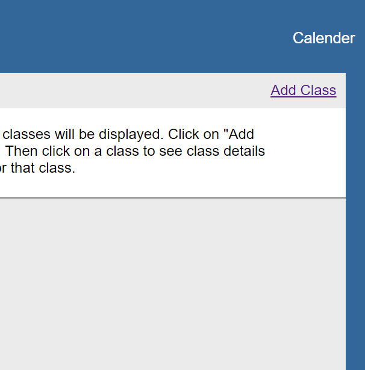

Enter class details and click save.  In order to use the calender functionality later, enter days of week (mon tue wed etc. optional).
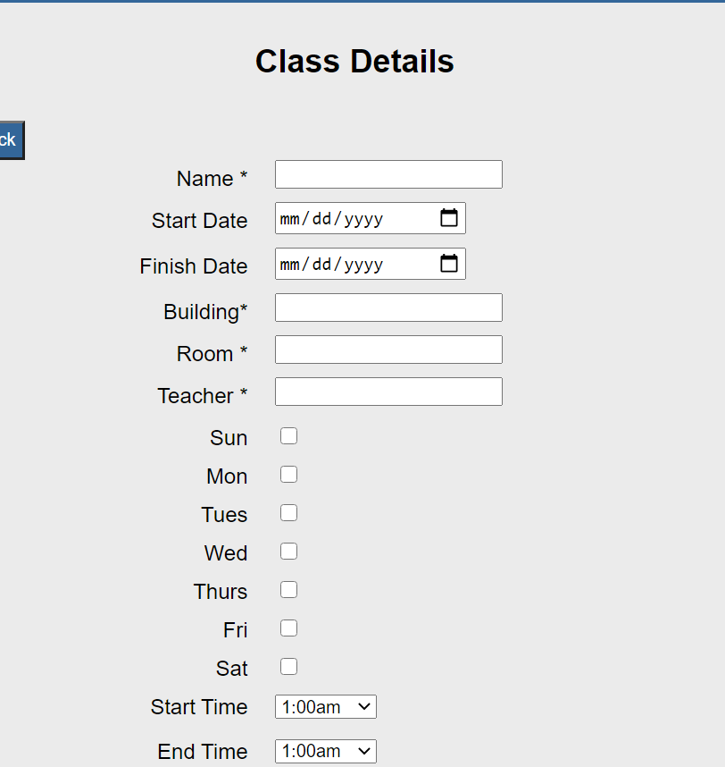

You now have a new class.
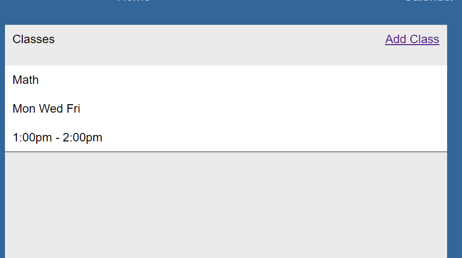

Now that you have a class you can add homework with "Add Homework".
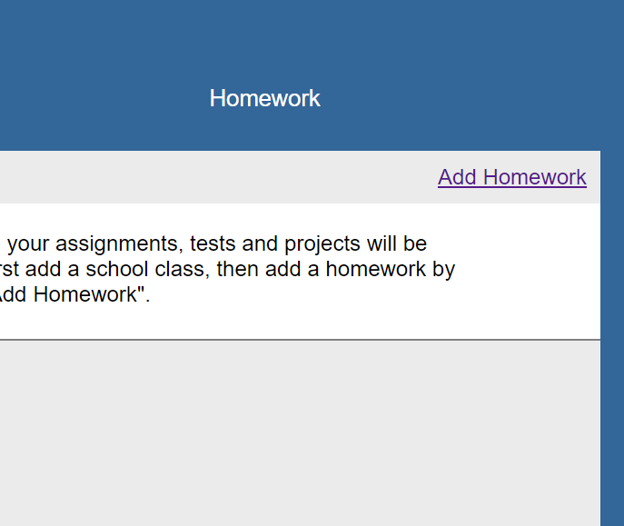

Enter homework details and click save.  The class you created previously will be selectable in a dropdown.
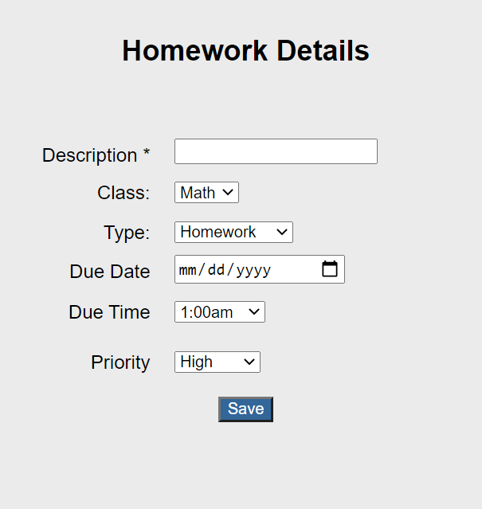

You now have a new homework.
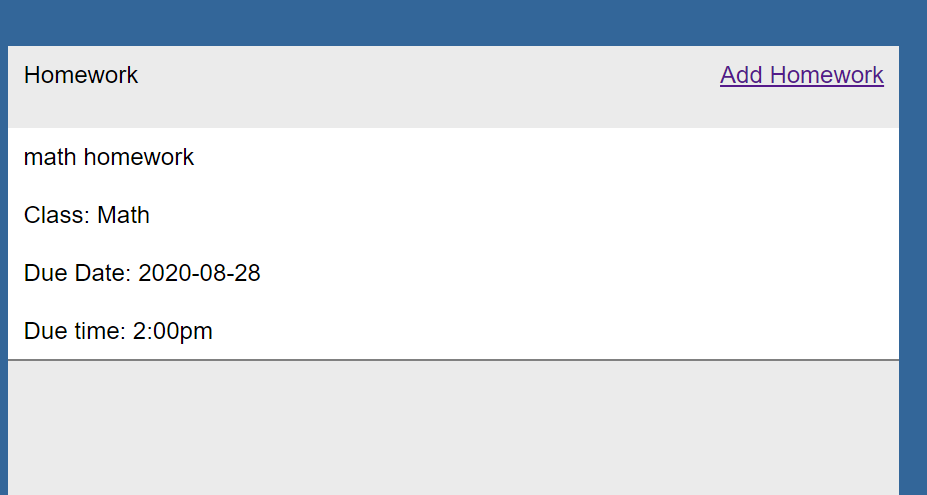

Using previous steps add a new class.  Then for this class add a new homework.
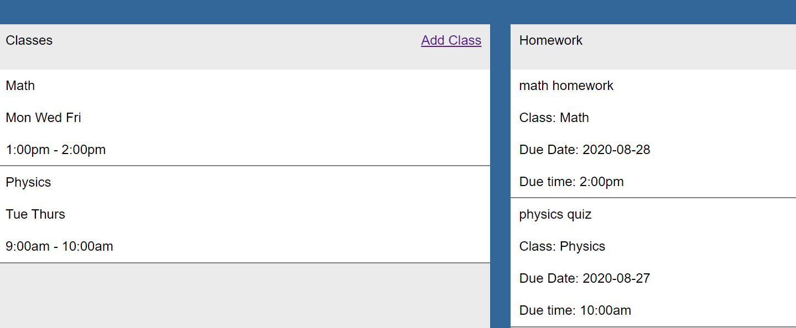

Click on a class to see class details.  When you click on a class, the homework column is filtered for only homework for that class.
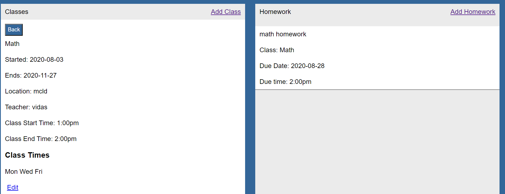

Click on a homework to see homework details.  Both class details and homework details pages have a edit button allowing you to edit class and homework details respectively.

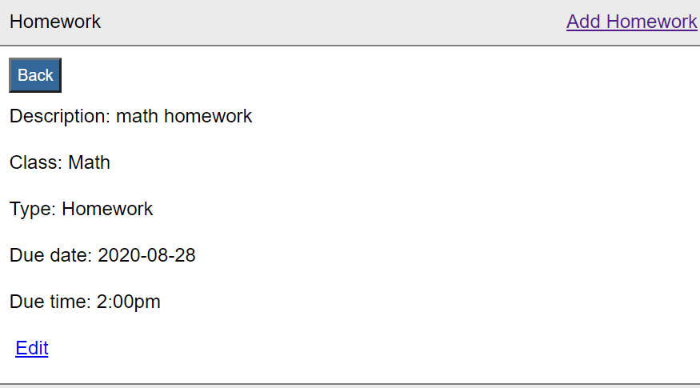
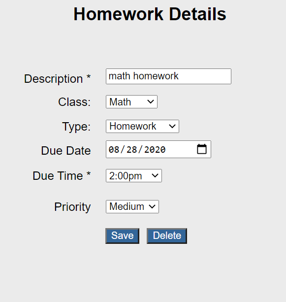  

Click on the "Calender" tab.
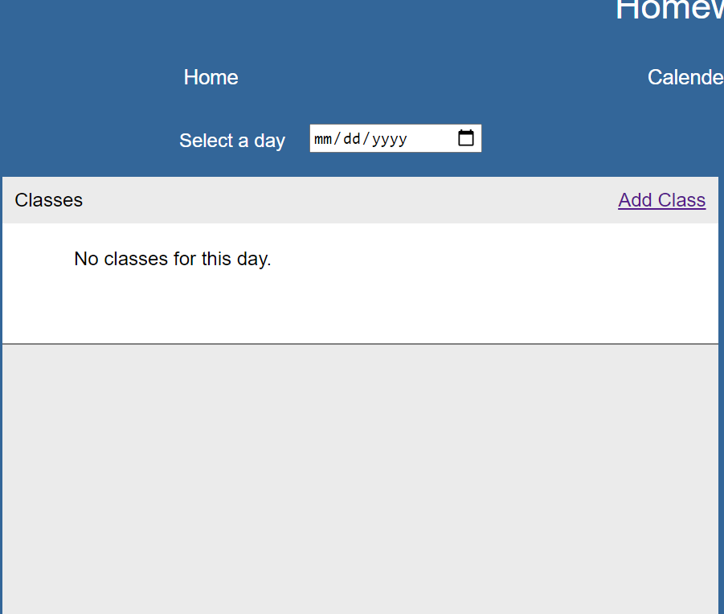

Select a date in the calender. If a class occurs on this day, it will be listed. You previously entered days of week when creating a class (mon tue wed etc.).  The class will not show up if you select a date before its start date or a date after its end date.
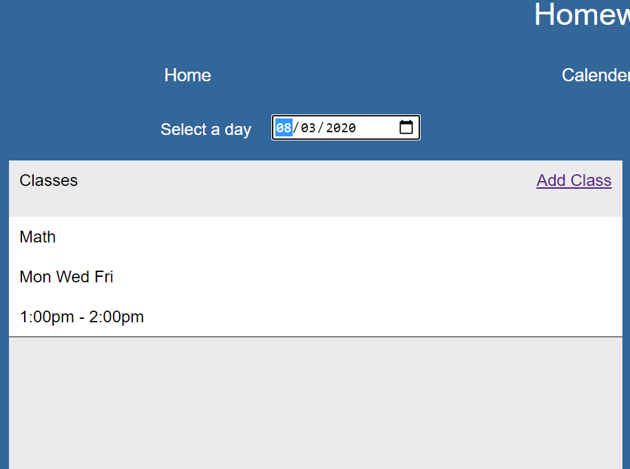

Selecting a day that has homework due will have homework for that day listed.
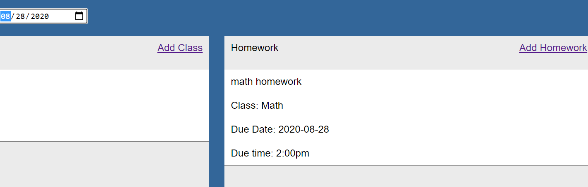

Click on "Homework" tab.  All homework is grouped under "Late" and "Pending".
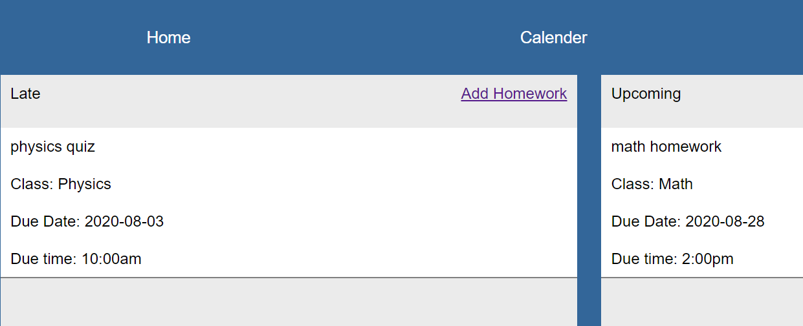

## Prerequisites

ShowApp requires Node.js v6.0+ to run.

ShowApp requires Node.js v6.0+ to run. Install the dependencies and devDependencies and start the server.

```npm install ```

## Starting the server

Start the application `npm start`


Run the tests `npm t`

##  Schema

schoolClass

```
schoolClass => ({
  id: schoolClass.id,
  classname: schoolClass.classname,
  finishdate: schoolClass.finishdate,
  startdate: schoolClass.startdate,
  building: schoolClass.building,
  room: schoolClass.room,
  teacher: schoolClass.teacher,
  starttime: schoolClass.starttime,
  endtime: schoolClass.endtime,
  sun: schoolClass.sun,
  mon: schoolClass.mon,
  tue: schoolClass.tue,
  wed: schoolClass.wed,
  thurs: schoolClass.thurs,
  fri: schoolClass.fri,
  sat: schoolClass.sat
})
```

##  API OVERVIEW

##  GET /api/schoolClass/
```
// req.query
{
  none expected
}

// res.body

  {
    {
  id: schoolClass.id,
  classname: schoolClass.classname,
  finishdate: schoolClass.finishdate,
  startdate: schoolClass.startdate,
  building: schoolClass.building,
  room: schoolClass.room,
  teacher: schoolClass.teacher,
  starttime: schoolClass.starttime,
  endtime: schoolClass.endtime,
  sun: schoolClass.sun,
  mon: schoolClass.mon,
  tue: schoolClass.tue,
  wed: schoolClass.wed,
  thurs: schoolClass.thurs,
  fri: schoolClass.fri,
  sat: schoolClass.sat
}
  }

```

##  POST /api/schoolClass/
```
// req.query
 {
  id: schoolClass.id,
  classname: schoolClass.classname,
  finishdate: schoolClass.finishdate,
  startdate: schoolClass.startdate,
  building: schoolClass.building,
  room: schoolClass.room,
  teacher: schoolClass.teacher,
  starttime: schoolClass.starttime,
  endtime: schoolClass.endtime,
  sun: schoolClass.sun,
  mon: schoolClass.mon,
  tue: schoolClass.tue,
  wed: schoolClass.wed,
  thurs: schoolClass.thurs,
  fri: schoolClass.fri,
  sat: schoolClass.sat
}

// res.body

  {
    {
  id: schoolClass.id,
  classname: schoolClass.classname,
  finishdate: schoolClass.finishdate,
  startdate: schoolClass.startdate,
  building: schoolClass.building,
  room: schoolClass.room,
  teacher: schoolClass.teacher,
  starttime: schoolClass.starttime,
  endtime: schoolClass.endtime,
  sun: schoolClass.sun,
  mon: schoolClass.mon,
  tue: schoolClass.tue,
  wed: schoolClass.wed,
  thurs: schoolClass.thurs,
  fri: schoolClass.fri,
  sat: schoolClass.sat
}
  }

```

##  GET /api/schoolClass/:schoolClass_id
```
// req.query
{
  schoolClass_id
}

// res.body
[
  {
    {
  id: schoolClass.id,
  classname: schoolClass.classname,
  finishdate: schoolClass.finishdate,
  startdate: schoolClass.startdate,
  building: schoolClass.building,
  room: schoolClass.room,
  teacher: schoolClass.teacher,
  starttime: schoolClass.starttime,
  endtime: schoolClass.endtime,
  sun: schoolClass.sun,
  mon: schoolClass.mon,
  tue: schoolClass.tue,
  wed: schoolClass.wed,
  thurs: schoolClass.thurs,
  fri: schoolClass.fri,
  sat: schoolClass.sat
}
  }
]
```

##  DELETE /api/schoolClass/:schoolClass_id
```
// req.query
{
  schoolClass_id
}

// res.body
[
  {
    {
    row_deleted    
    }
  }
]
```

##  PATCH /api/schoolClass/:schoolClass_id
```
// req.query
{
  schoolClass_id
}

// res.body

  {
    {
  id: schoolClass.id,
  classname: schoolClass.classname,
  finishdate: schoolClass.finishdate,
  startdate: schoolClass.startdate,
  building: schoolClass.building,
  room: schoolClass.room,
  teacher: schoolClass.teacher,
  starttime: schoolClass.starttime,
  endtime: schoolClass.endtime,
  sun: schoolClass.sun,
  mon: schoolClass.mon,
  tue: schoolClass.tue,
  wed: schoolClass.wed,
  thurs: schoolClass.thurs,
  fri: schoolClass.fri,
  sat: schoolClass.sat
}
  }

```

##  Schema

homework

```
homework => ({
  homeworkid: homework.homeworkid,
  classid: homework.classid,
  homeworkdescription: homework.homeworkdescription,
  schoolclass: homework.schoolclass,
  homeworktype: homework.homeworktype,
  duedate: homework.duedate,
  duetime: homework.duetime,
  homeworkpriority: homework.homeworkpriority
})
```

##  API OVERVIEW

##  GET /api/homework/
```
// req.query
{
  none expected
}

// res.body

  {
    {
  homeworkid: homework.homeworkid,
  classid: homework.classid,
  homeworkdescription: homework.homeworkdescription,
  schoolclass: homework.schoolclass,
  homeworktype: homework.homeworktype,
  duedate: homework.duedate,
  duetime: homework.duetime,
  homeworkpriority: homework.homeworkpriority
}
  }

```

##  POST /api/homework/
```
// req.query
 {
  homeworkid: homework.homeworkid,
  classid: homework.classid,
  homeworkdescription: homework.homeworkdescription,
  schoolclass: homework.schoolclass,
  homeworktype: homework.homeworktype,
  duedate: homework.duedate,
  duetime: homework.duetime,
  homeworkpriority: homework.homeworkpriority
}

// res.body

  {
    {
  homeworkid: homework.homeworkid,
  classid: homework.classid,
  homeworkdescription: homework.homeworkdescription,
  schoolclass: homework.schoolclass,
  homeworktype: homework.homeworktype,
  duedate: homework.duedate,
  duetime: homework.duetime,
  homeworkpriority: homework.homeworkpriority
}
  }

```

##  GET /api/homework/:homework_id
```
// req.query
{
  homework_id
}

// res.body
[
  {
    {
  homeworkid: homework.homeworkid,
  classid: homework.classid,
  homeworkdescription: homework.homeworkdescription,
  schoolclass: homework.schoolclass,
  homeworktype: homework.homeworktype,
  duedate: homework.duedate,
  duetime: homework.duetime,
  homeworkpriority: homework.homeworkpriority
}
  }
]
```

##  DELETE /api/homework/:homework_id
```
// req.query
{
  homework_id
}

// res.body
[
  {
    {
    row_deleted    
    }
  }
]
```

##  PATCH /api/homework/:homework_id
```
// req.query
{
  homework_id
}

// res.body

  {
    {
  homeworkid: homework.homeworkid,
  classid: homework.classid,
  homeworkdescription: homework.homeworkdescription,
  schoolclass: homework.schoolclass,
  homeworktype: homework.homeworktype,
  duedate: homework.duedate,
  duetime: homework.duetime,
  homeworkpriority: homework.homeworkpriority
}
  }

```

# Built with

Node, Express, Mocha, Chai

# Authors

Allan Cheng
